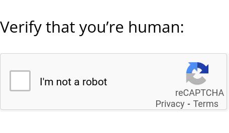

## A simple jsPsych demo showing how to use reCaptcha v2 to verify that the user is human

Structure:
- `experiment.html` is boring: it only loads the experiment.
- `experiment.js`: This is where the experiment is defined.
- `recaptcha.html`: This is where the reCaptcha is defined.  You need to insert the “site key” obtained from google for it to work.  To obtain a site key, visit https://cloud.google.com/security/products/recaptcha and click on "Get started".

Note, that the reCaptcha will only work when the experiment is served from the domain name indicated when registering the site key.

Screen shot:

The experiment is served with the script `server.py` described [here](https://github.com/tmalsburg/selfhost_ling_expts).
